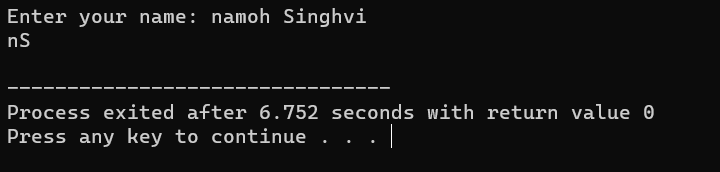
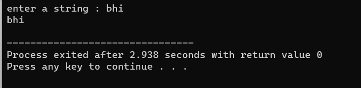

# strings-char-array
1] [Initals Printer](str_initials.cpp)

This is a C++ program that allows a user to input their full name and extracts the first and last names. It achieves this by searching for the first space character in the input and then printing the first name (up to the first space) and the last name (everything after the first space).

The program is simple and straightforward, making it a basic example of string manipulation in C++.

  

 

2] [Input Printer](str_ip_op.cpp)

This program inputs a char array and prints it.

  

 

3] [Length calci](strpointer.cpp)
This C++ program calculates the length of a C-style string by iterating through the characters using a pointer until it reaches the null terminator ('\0'). It then subtracts the starting address from the ending address to determine the length of the string and displays it. This program demonstrates a basic approach to determining the length of a string.

  

 

4] [Length calci advanced](strpointer2.cpp)

  

 
